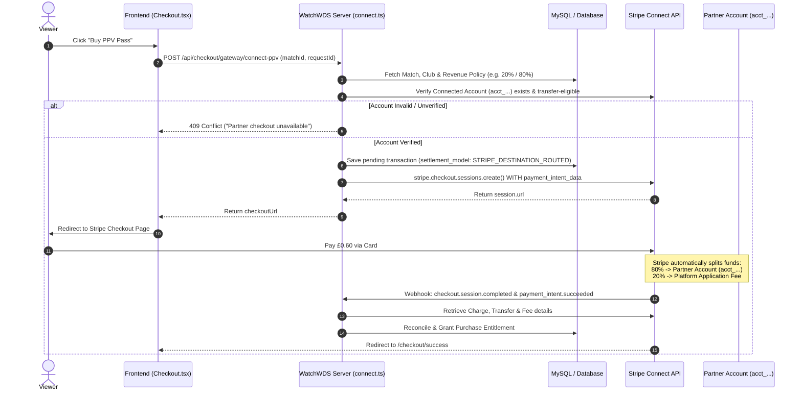

# Stripe Connect Split Payments Breakdown & Code Analysis

This document provides a thorough analysis of how **Stripe Connect Split Payments** work, why your current platform recorded splits locally without splitting money on Stripe, and how to fix it in the [`Snoowiz/watch-wd`](https://github.com/Snoowiz/watch-wd) codebase.

---

## 1. Executive Summary & Root Cause Analysis

### The Problem
In your current implementation of [`Snoowiz/watch-wd`](https://github.com/Snoowiz/watch-wd), payments made by viewers (e.g., £0.60 for a PPV match) recorded revenue splits in your local database (`transactions`, `club_balances`, `revenue_policies`), but **Stripe retained 100% of the funds in the platform account** without transferring any money to the partner/club’s connected account (`acct_...`).

### The Root Cause
When calling `stripe.checkout.sessions.create()` in the baseline `server.ts`, the request parameters were missing the `payment_intent_data` block containing `transfer_data` and `application_fee_amount`.

#### Baseline Code (Broken Flow):
```typescript
// ❌ Missing payment_intent_data destination routing!
const sessionParams = {
  payment_method_types: ["card"],
  line_items: [ ... ],
  mode: "payment",
  success_url: `${origin}/checkout/success...`,
  cancel_url: `${origin}/checkout/cancel`,
  client_reference_id: transactionId,
  metadata: {
    txn_id: transactionId,
    match_id: String(matchId),
    club_id: String(clubId),
    user_id: userId,
    payment_type: "ppv_watch"
  }
};
const session = await stripe.checkout.sessions.create(sessionParams);
```

#### Why Local Split Recorded, but Stripe Didn't Split:
1. **Local DB Layer**: Your Express server calculated `applicationFeeCents` and stored partner metadata in MySQL / Firestore.
2. **Stripe API Layer**: Because `payment_intent_data.transfer_data.destination` was omitted, Stripe created a standard single-party payment. Stripe has **no knowledge of your local database calculations** unless explicitly instructed via the API.
3. **Result**: The entire payment went to your main platform balance, while local logs incorrectly indicated a split had taken place.

---

## 2. How Stripe Connect Architecture Works

### 2.1 Connected Account Concept
* **What is a Connected Account ID?**  
  Every partner/club onboarded via Stripe Connect receives a unique Stripe Account ID starting with `acct_` (e.g., `acct_1N9xABC12345XYZ`).
* **Are Connected Accounts "under" the Main Account?**  
  **Yes.** They are distinct legal/financial entities linked directly to your **Stripe Platform Account**. They can be Express, Custom, or Standard account types.
* **Can you send money to an external Account ID?**  
  You can only route funds to connected account IDs (`acct_...`) that have been onboarded and linked to your specific Platform Account ID (`WATCHWDS_STRIPE_PLATFORM_ID`). You **cannot** send funds to arbitrary external Stripe accounts that are not connected to your platform.

---

### 2.2 Split Payment Methods: Destination Charges vs. Separate Charges & Transfers

Stripe Connect supports two main ways to handle splits:

| Feature | Destination Charges (Recommended for PPV) | Separate Charges & Transfers |
| :--- | :--- | :--- |
| **How it works** | The charge is created on the platform, but automatically routed to the connected account `destination`. Platform retains `application_fee_amount`. | Platform charges customer 100%, keeps money in platform balance, then manually/periodically calls `stripe.transfers.create()`. |
| **Automatic Split** | **Instant & Automatic** at moment of purchase. | Manual or batch-scheduled background job. |
| **Stripe Fees** | Deducted automatically according to Connect settings. | Platform pays transaction fee; transfer incurs separate payout logic. |
| **Refund Reversal** | `stripe.refunds.create({ reverse_transfer: true, refund_application_fee: true })` automatically reverses both sides. | Manual transfer reversal needed. |

> [!IMPORTANT]
> **Destination Charges** (`payment_intent_data.transfer_data.destination` + `application_fee_amount`) are the official and standard way to achieve **automatic instant splitting** on Stripe Checkout.

---

### 2.3 Automatic Split Mechanism in Code

To perform an automatic split via **Stripe Checkout Session**, the server must supply the following structure:

```typescript
const sessionParams = {
  mode: "payment",
  line_items: [{
    price_data: {
      currency: "gbp",
      unit_amount: 1000, // Total price: £10.00 (1000 pence)
      product_data: { name: "Match Access - SE Dons vs Competitor" }
    },
    quantity: 1
  }],
  payment_intent_data: {
    // 1. Fee retained by Platform (e.g., 20% of £10.00 = £2.00 / 200 pence)
    application_fee_amount: 200, 
    
    // 2. Destination connected account receiving the remaining £8.00 (800 pence)
    transfer_data: {
      destination: "acct_1SE_DONS_CONNECTED_ID" 
    },
    metadata: {
      txn_id: "txn_connect_12345",
      settlement_model: "STRIPE_DESTINATION_ROUTED"
    }
  },
  client_reference_id: transactionId,
  success_url: `${origin}/checkout/success?session_id={CHECKOUT_SESSION_ID}`,
  cancel_url: `${origin}/checkout/cancel`
};
```

---

### 2.4 Required Stripe Dashboard & Account Settings

Before destination routing can work in production, the following conditions must be satisfied on Stripe:

1. **Stripe Connect Enabled**: Platform must activate Stripe Connect in the Stripe Dashboard.
2. **Account Onboarding Complete**:
   - `details_submitted = true`
   - `payouts_enabled = true`
   - `capabilities.transfers = 'active'`
3. **Platform Match**: Connected Account must belong to the exact platform ID matching `WATCHWDS_STRIPE_PLATFORM_ID`.
4. **Live/Test Environment Sync**: Secret API keys (`STRIPE_SECRET_KEY`) must match the account environment (`live` vs `test`).

---

## 3. Workflow Architecture Diagram



---

## 4. Codebase Comparison: Baseline vs. Patched (`watchwds-connect.patch`)

### 4.1 Comparison Table

| Aspect | Baseline Code (`server.ts`) | Patched Code (`payments/connect.ts` & `server.ts`) |
| :--- | :--- | :--- |
| **Destination Routing** | ❌ Omitted (`payment_intent_data` missing) | ✅ Fully enforced (`transfer_data.destination` set) |
| **Application Fee** | ❌ Omitted (`application_fee_amount` missing) | ✅ Calculated from server revenue policy and passed |
| **Account Validation** | ❌ Assumed valid string from DB | ✅ Live API check: `stripe.accounts.retrieve()` & transfer capability check |
| **Failure Mode** | ⚠️ Failed OPEN: collected 100% on platform if routing failed | 🛑 Fails CLOSED: rejects checkout if account/policy is missing or ineligible |
| **Legacy Ledger Isolation** | ❌ Mixed destination orders into legacy payout engine | ✅ Stamped `STRIPE_DESTINATION_ROUTED` and permanently excluded from legacy payout worker |
| **Refund Handling** | ❌ Manual/untracked refund | ✅ Reverse transfer + fee refund: `reverse_transfer: true`, `refund_application_fee: true` |

---

### 4.2 Exact Patched Implementation Snippet (`payments/connect.ts`)

```typescript
// Constructing valid Destination Charge Session Parameters
function sessionParams(id: string, userId: string, m: SnapshotMetadata) {
  const metadata = { 
    txn_id: id, 
    user_id: userId, 
    match_id: m.matchId, 
    club_id: m.clubId, 
    payment_type: "ppv_watch", 
    settlement_model: "STRIPE_DESTINATION_ROUTED" 
  };
  
  return {
    mode: "payment",
    line_items: [{ 
      price_data: { 
        currency: m.currency, 
        unit_amount: m.totalAmountCents, 
        product_data: { name: m.title } 
      }, 
      quantity: 1 
    }],
    client_reference_id: id,
    metadata,
    payment_intent_data: { 
      application_fee_amount: m.applicationFeeCents, 
      transfer_data: { destination: m.connectedAccountId }, 
      metadata 
    },
    success_url: `${m.origin}/checkout/success?session_id={CHECKOUT_SESSION_ID}&txn_id=${id}&gateway=stripe`,
    cancel_url: `${m.origin}/checkout/cancel`,
    expires_at: m.expiresAt
  };
}
```

---

## 5. Verification & Controlled Deployment Plan

To ensure payments split properly without disrupting existing features, follow this step-by-step verification plan:

### 5.1 Environment Variables Required on Server

Set the following runtime environment variables on Hostinger / Express server:

```env
WATCHWDS_CONNECT_RELEASE=controlled
WATCHWDS_STRIPE_PLATFORM_ID=acct_YOUR_WDSVOD_PLATFORM_ID
WATCHWDS_STRIPE_MODE=live
WATCHWDS_CONNECT_APPROVED_POLICY_IDS=policy_id_for_se_dons
WATCHWDS_CONNECT_TEST_USER_ID=your_test_user_id
WATCHWDS_CONNECT_TEST_MATCH_ID=your_test_match_id
WATCHWDS_CONNECT_FINANCE_APPROVED=true
APP_URL=https://watchwds.com
STRIPE_SECRET_KEY=sk_live_...
STRIPE_WEBHOOK_SECRET=whsec_...
```

---

### 5.2 Deployment Steps

1. **Apply Patch**: Apply `watchwds-connect.patch` to the codebase baseline (`5bd79ae6ceb3a261c80ef76f19724e46fddd096c`).
2. **Build Server Bundle**:
   ```bash
   npm ci --ignore-scripts
   npm run build
   npm test
   ```
3. **Deploy to Hostinger**: Push to `main` branch to trigger Hostinger auto-deployment.
4. **Perform One Controlled Test Purchase**:
   - Make 1 live PPV purchase (e.g. £0.60).
   - Log into **Stripe Dashboard**.
   - Navigate to **Payments** -> Select the Payment Intent.
   - Verify **Transfer**: Confirm funds routed to `acct_...` (SE Dons).
   - Verify **Application Fee**: Confirm platform retained 20%.
5. **Perform Controlled Refund Test**:
   - Call `POST /api/admin/transactions/:id/refund-connect`.
   - Confirm customer refunded, transfer reversed (`reverse_transfer: true`), and application fee returned (`refund_application_fee: true`).
6. **Promote Release**: Set `WATCHWDS_CONNECT_RELEASE=active`.

---

## 6. Checklist Summary

- [x] **Root cause identified**: Missing `payment_intent_data` in Stripe API call.
- [x] **Stripe Connect concepts clarified**: Destination charges handle automatic splitting instantly.
- [x] **Code fix reviewed**: `payments/connect.ts` enforces `transfer_data.destination` + `application_fee_amount`.
- [x] **Failure mode secured**: Fails closed if partner account is unverified or missing.
- [x] **Ledger protected**: Destination orders are excluded from legacy manual payout scripts.
